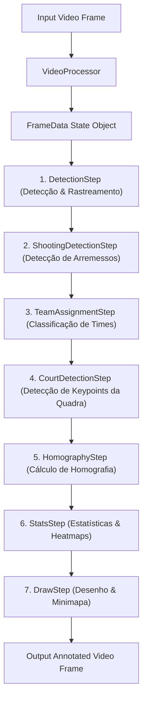

# Detecção e Rastreamento em Vídeos de Basquete

Um projeto de visão computacional para detecção, rastreamento, classificação de times, detecção de arremessos e análise estatística de jogadores em partidas de basquete utilizando Deep Learning.

---

## 🔗 Links Importantes

### Google Drive
- **Drive Geral:** [Acessar Pasta](https://drive.google.com/drive/folders/1GdiMeBQQnJj_BLjoXBCNLijer-qsqcwl?usp=sharing)
- **Jogos e Jogadas:** [Acessar Pasta](https://drive.google.com/drive/folders/1J6hSiDR8wj_zLLnXCupuO96p5TGaYoQz?usp=sharing)
- **Modelos:** [Acessar Pasta](https://drive.google.com/drive/folders/1qmdY6Vd8N2TU-Cf6S4XmHXMsv9E8jW3b?usp=sharing)

### Gerenciamento & Comunicação
- **Notion Geral:** [Acessar Página](https://www.notion.so/Diretoria-Vis-o-Computacional-2026-1-304fd02ff8f5802a9c84e141bce5a371?source=copy_link)
- **Board Trello (Tasks):** [Acessar Trello](https://trello.com/invite/b/698124b4a563904c35ed5194/ATTI27b425f8cfc1217d0fd701ef8b42a21334DC5A3E/tasks-cv)

### Repositórios Auxiliares
- **CourtSlicer (Corte de Jogadas):** [GabrielCFormiga/CourtSlicer](https://github.com/GabrielCFormiga/CourtSlicer)

---

## 🛠️ Arquitetura do Pipeline

O núcleo da aplicação baseia-se em um padrão de **Pipeline Modular** (Chain of Responsibility) implementado em `src/core`.



### 📦 Estrutura dos Dados e Fluxo (`FrameData`)
A cada frame de vídeo processado pelo [VideoProcessor](file:///home/victor/Documentos/Programação/CV_2026.1/src/core/video_processor.py), um objeto mutável da classe [FrameData](file:///home/victor/Documentos/Programação/CV_2026.1/src/core/frame_data.py) é instanciado. Este objeto atua como o **estado centralizador**, acumulando as saídas geradas por cada uma das etapas do pipeline:
- `detections`: Caixas delimitadoras (bounding boxes), confianças e classes brutas obtidas do detector.
- `tracks`: Caixas delimitadoras associadas com IDs de rastreamento persistentes.
- `segmentation_masks`: Máscaras de segmentação pixel a pixel de cada jogador.
- `team_ids` & `team_names`: Identificação dos times associados a cada jogador.
- `poses`: Esqueletos (keypoints corporais COCO-17) estimados para cada jogador.
- `shooting_flags` & `shooting_confidences`: Flags e confianças indicando se um jogador está em movimento de arremesso.
- `court_keypoints`: Keypoints detectados da quadra de basquete.
- `homography_matrix`: Matriz 3x3 de transformação perspectiva entre a imagem e o template bidimensional da quadra.
- `fps`: Taxa de quadros do vídeo de entrada para calibração de métricas de tempo.
- `recorded_shots`: Lista de arremessos acumulados contendo `(frame_id, track_id, x_world, y_world)`.

---

## 🚶 Detalhamento das Etapas do Pipeline

O fluxo de processamento configurado no arquivo principal [main.py](file:///home/victor/Documentos/Programação/CV_2026.1/main.py) contém as seguintes etapas:

1. **[DetectionStep](file:///home/victor/Documentos/Programação/CV_2026.1/src/detectors/players/detection_step.py):**
   - Executa a detecção de jogadores, bola e cestos com o parâmetro `use_tracking=True` ativado.
   - Utiliza detectores baseados em PyTorch/YOLO como o [RFDETRDetector](file:///home/victor/Documentos/Programação/CV_2026.1/src/detectors/players/rfdetr_detector.py) (modelo `rfdetr-m-basketball.pth`) ou o [YOLO26Detector](file:///home/victor/Documentos/Programação/CV_2026.1/src/detectors/players/yolo26_detector.py) para extrair localizações e IDs persistentes de rastreamento (tracking) entre frames adjacentes, preenchendo as chaves `detections` e `tracks` no `FrameData`.
2. **[ShootingDetectionStep](file:///home/victor/Documentos/Programação/CV_2026.1/src/actions/shooting_detection_step.py):**
   - Executa estimativa de pose humana nos jogadores usando o [PoseEstimator](file:///home/victor/Documentos/Programação/CV_2026.1/src/pose/pose_estimator.py).
   - O classificador de arremessos baseado em regras ([RuleBasedShootingClassifier](file:///home/victor/Documentos/Programação/CV_2026.1/src/actions/rule_based_shooting_classifier.py)) analisa características das poses corporais (como ângulos e distâncias relativas entre articulações) e gerencia o estado por meio do `ShootingStateManager`.
3. **[TeamAssignmentStep](file:///home/victor/Documentos/Programação/CV_2026.1/src/teams/team_assignment_step.py):**
   - Segmenta os pixels do jogador utilizando o [PlayerSegmenter](file:///home/victor/Documentos/Programação/CV_2026.1/src/segmentation/player_segmentation.py) (com `yolo26m-seg.pt`) para ignorar o fundo (quadra/torcida).
   - Classifica o time do jogador (Time 1, Time 2 ou sem time) utilizando [TeamClassifierFashionCLIP](file:///home/victor/Documentos/Programação/CV_2026.1/src/teams/team_classifier_fashion_clip.py) ou HSV.
   - Aplica um sistema de voto temporal via [TeamVoteManager](file:///home/victor/Documentos/Programação/CV_2026.1/src/teams/team_vote_manager.py) para estabilizar as atribuições de times entre frames.
4. **[CourtDetectionStep](file:///home/victor/Documentos/Programação/CV_2026.1/src/detectors/court/court_detector_step.py):**
   - Detecta pontos-chave de interesse da quadra (Keypoints) a partir de um modelo dedicado YOLOv8-Keypoint ([YOLOCourtDetector](file:///home/victor/Documentos/Programação/CV_2026.1/src/detectors/court/yolo_court_detector.py)).
5. **[HomographyStep](file:///home/victor/Documentos/Programação/CV_2026.1/src/homography/homography_step.py):**
   - Pareia os keypoints detectados com a representação oficial bidimensional da quadra carregada de um template JSON (`dst_homo_2 bkp.json`).
   - Calcula a matriz de Homografia usando RANSAC.
   - Corrige distorções de espelhamento impossíveis na rotação da câmera com SVD (`fix_homography_flip`).
6. **[StatsStep](file:///home/victor/Documentos/Programação/CV_2026.1/src/stats/stats_step.py):**
   - Acumula as métricas físicas (distâncias, velocidades) e calibra a escala em metros reais baseado no template.
   - Detecta arremessos individuais de jogadores com base nas transições de estado de arremesso, propagando-os em `data.recorded_shots`.
   - Exporta sumários de dados e múltiplos heatmaps e mapas de arremessos para o diretório `outputs/stats/` no final do processamento (ciclo `finish()`).
7. **[DrawStep](file:///home/victor/Documentos/Programação/CV_2026.1/src/core/draw_step.py):**
   - Renderiza todas as métricas agregadas diretamente nos frames. Desenha caixas delimitadoras coloridas por time, máscaras de segmentação semi-transparentes, esqueletos de pose e projeta a posição dos jogadores (pé do jogador) e os arremessos ocorridos (marcas vermelhas `X`) em um minimapa tático procedural da quadra inserido no canto da imagem.

---

## 🚀 Como Executar o Projeto

Todo o desenvolvimento e testes devem ser executados utilizando o ambiente virtual Conda chamado `tail`.

### 1. Configurando o Ambiente
Para ativar o ambiente do Conda:
```bash
conda activate tail
```

### 2. Executando o Pipeline Completo (`main.py`)
O arquivo principal [main.py](file:///home/victor/Documentos/Programação/CV_2026.1/main.py) gerencia e roda o pipeline modular (Chain of Responsibility) de ponta a ponta. Ele processa o vídeo configurado e, ao finalizar, exporta todas as métricas físicas, mapas de calor e o mapa de arremessos automaticamente.

Para rodar o pipeline principal:
```bash
conda run -n tail python main.py
```
*(Ou `python main.py` se o ambiente virtual `tail` já estiver ativado).*

**O que ele faz:**
- Lê o vídeo de entrada (ex: `videos/Posse_IFPB_3.mp4`).
- Executa a detecção, rastreamento, pose, segmentação, times, homografia e estatísticas (`StatsStep`).
- Renderiza o vídeo com anotações e um minimapa tático que plota arremessos (`DrawStep`).
- Salva o vídeo resultante em `videos/` e as estatísticas em `outputs/stats/`.

---

## 📊 Análise de Estatísticas e Testes

Para calcular e reportar métricas do jogo separadamente ou realizar testes rápidos, o script [test_stats.py](file:///home/victor/Documentos/Programação/CV_2026.1/scripts/test_stats.py) é fornecido como uma ferramenta de teste de ponta a ponta.

### Métricas Computadas
- **Distância Total (m):** Distância física percorrida pelo jogador na quadra convertida a partir da escala da homografia ($\approx 10.71$ pixels por metro, ajustado com base no comprimento da quadra de 28m da FIBA).
- **Velocidade Média e Máxima (km/h):** Calculada por diferenciação temporal com base na taxa de quadros (FPS) do vídeo.
- **Área Ocupada (m²):** Convex hull gerado a partir dos pontos por onde o jogador passou na quadra.

### Executando o Script de Teste
Para executar o teste de estatísticas em um vídeo específico:
```bash
conda run -n tail python scripts/test_stats.py --video videos/Posse_IFPB_3.mp4
```

#### Parâmetros Opcionais:
- `--detector-weights`: Caminho dos pesos do detector de jogadores (padrão: `models/rfdetr-m-basketball.pth`).
- `--court-weights`: Caminho dos pesos do detector de quadra (padrão: `models/court_keypoint/yolo26m-court-v8a.pt`).
- `--template`: Caminho do template JSON da homografia (padrão: `assets/dst_homo.json`).
- `--court-width`: Comprimento da quadra em metros (padrão: `28.0`).
- `--court-length`: Largura da quadra em metros (padrão: `15.0`).
- `--fps`: Forçar um FPS específico (padrão: `0` para ler do vídeo).
- `--max-frames`: Limitar o número de frames processados (padrão: `0` para o vídeo completo).
- `--output-csv`: Caminho de saída do CSV (padrão: `outputs/stats/stats_summary.csv`).
- `--no-display`: Desabilita a exibição em tempo real da janela de visualização do OpenCV.

---

## 📁 Resultados e Saídas Geradas

Todos os relatórios, mapas de calor e visualizações de arremessos são isolados e exportados para a pasta `outputs/stats/` (que está configurada no `.gitignore` para evitar o envio desnecessário de arquivos temporários ao repositório).

As saídas geradas incluem:
1. **`stats_summary.csv`**: Tabela com distância, velocidades, área ativa e contagem de frames de cada jogador por ID.
2. **`heatmap_whole.png`**: Mapa de calor geral sobreposto à imagem da quadra, mostrando a movimentação acumulada de todos os jogadores.
3. **`teams/`**: Pasta contendo os mapas de calor individuais de cada equipe (`heatmap_team_1.png` e `heatmap_team_2.png`).
4. **`players/`**: Pasta contendo o mapa de calor individual de cada jogador com base no ID de rastreamento (ex: `heatmap_player_1.png`).
5. **`shotmap.png`**: Mapa que plota a localização espacial de todos os arremessos detectados (transição de estado de arremesso `False -> True`) representados por marcas de cruz vermelha (`X`).

---


## 📂 Organização das Pastas do Repositório

- **`assets/`** - Templates de homografia (JSON) e imagens estáticas de quadras.
- **`fashionclip_trained/`** - Pesos e checkpoints do classificador FashionCLIP ajustados.
- **`models/`** - Modelos locais de deep learning (detectores de quadra, poses e jogadores).
- **`notebooks/`** - Notebooks Jupyter com análises exploratórias e exemplos rápidos.
- **`players_dataset/`** - Imagens de crops de jogadores exportadas pelo pipeline para validação visual ou re-treino.
- **`src/`** - Código-fonte modular do projeto:
  - `core/` - Motor de processamento, definição de `FrameData` e `DrawStep`.
  - `detectors/` - Código de detecção (jogadores e quadra).
  - `actions/` - Classificação de ações baseadas em pose (como arremessos).
  - `homography/` - Cálculo de homografia e correção geométrica.
  - `pose/` - Extrator de poses corporais.
  - `segmentation/` - Segmentador de jogadores.
  - `teams/` - Classificadores de times baseados em HSV/CLIP/FashionCLIP.
  - `stats/` - Cálculo e visualização de trajetórias, velocidades e heatmaps.
- **`videos/`** - Vídeos de entrada/teste e saídas geradas com anotações.
